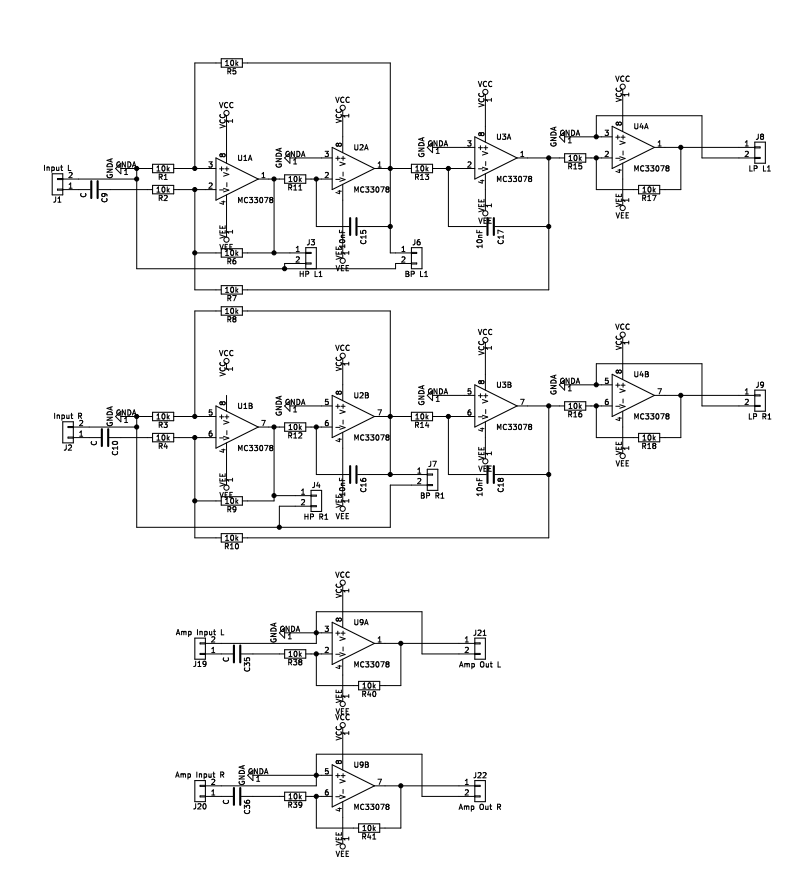

# KicadBiquadFilter
Manually variable stereo filter (BP, HP, LP) in two sections

## Status - Rev A Produced Both sections operational
### Errata
 * Section 2 feedback OpAmp incorrect - has to be bypassed
 * Footprint of Op Amp little too small for the packages in stock
 
### Issues and Notes
Issues

Wishlist for Rev B 
 - should handle connectors and Potmeters on the PCB
 - Potmeters should have optional resistor in series and parallel
 - Section 1 adjustable: R5/6 stereo 100k + 680R and R11/13 stereo 20k + 680R
 - Capacitors as THT 47nF polyprop
 - Focus on Eurorack compatibility
 - Mono filter 
 - VCF option

## Physical Construction
 - 100x100mm
 - Several resistors has been selected as THT components so a Potmeter can be placed instead
 
The board is split in two, joined at the center of the board. Each section is a stereo section that can operate individually.
### Section 1 - State Variable filter and buffer amp

### Section 2 - State Variable filter and regulator

## Vital Components
 - Op Amp is chosen as MC33078 but can be selected as long as its pin compatible like (ua833, TL062, TL072, TL082, etc)

### Section 1 Filter components for High Q variable freq and Q:
 - R8 / R5   - 680R + 100k Stereo Pot
 - R10 / R7  - 680R + 100k Stereo Pot
 - R3 / R1   - 47k
 - R4 / R2   - 47k
 - R9 / R6   - 47k
 - R12 / R11 - 680R + 20k Stereo Pot
 - R14 / R13 - 680R + 20k Stereo Pot
 - R16 / C15 - 47nF
 - R18 / C17 - 47nF
 
Fc - 163Hz - 5KHz 

Q - 0,68 - 6,9

## Features
The state variable filter can be configured in different ways and needs to be calculated before the components are selected.

https://www.electronics-tutorials.ws/filter/state-variable-filter.html
